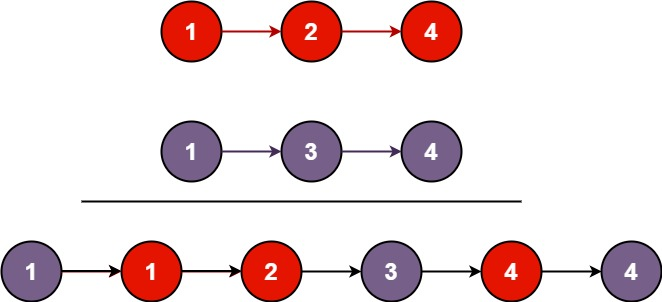

Description:
You are given the heads of two sorted linked lists list1 and list2.

Merge the two lists into one sorted list. The list should be made by splicing together the nodes of the first two lists.

Return the head of the merged linked list.

 

Example 1:
Input: list1 = [1,2,4], list2 = [1,3,4]
Output: [1,1,2,3,4,4]
Example 2:

Input: list1 = [], list2 = []
Output: []
Example 3:

Input: list1 = [], list2 = [0]
Output: [0]

Descrição:
Você recebe as cabeças de duas listas encadeadas "list1" e "list2"

Mescle as duas listas em uma lista ordenada. A lista devera ser feita emendando os nós das primeiras duas listas

Retorne a cabeça da lista encadeada mesclada.

 
Exemplo 1:
Entrada: list1 = [1,2,4], list2 = [1,3,4]
Saída: [1,1,2,3,4,4]

Exemplo 2:
Entrada: list1 = [], list2 = []
Saída: []

Exemplo 3:
Entrada: list1 = [], list2 = [0]
Saída: [0]